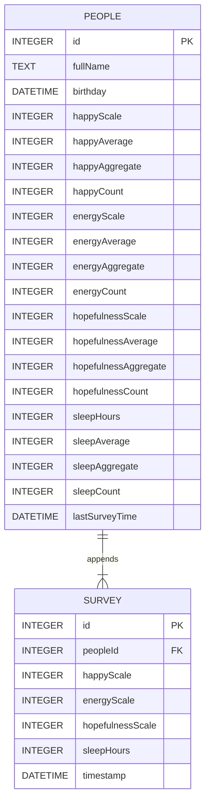

# mood-survey-app &middot; []

## Introduction

This project will present a user with a mood survey questionnaire, capable of capturing their state of mind and storing the data on the backend.

The survey result will be compared to the previous enteries by the user as well as compared to all other people in the same age group.

### Tech Stack

This project is a javascript application using the following tech stacks.

- **TypeScript:**
- **ExpressJS:**
- **Sqlite:**
- **ReactJS:**
- **Bootstrap UI:**

## Installation

### Requirements

- Any PC or MAC with NodeJS 16+ installed.
- Git command line tool

### Repo Install

The project can be cloned from GitHub for free with the following command

```bash
git clone git@github.com:edster9/mood-survey-app.git

# run backend and frontend together
cd mood-survey-app
yarn run install:dep
yarn dev

# OR (individually)

# run backend
cd mood-survey-app
yarn
yarn server:dev

# run backend
cd mood-survey-app/client
yarn
yarn start
```

## Design considerations

Data is stored to a local sqlite database with two tables. The frontend ReactJS client will post to the ExpressJS backend via a REST API everytime there is a new mood survey request.

### Database Tables (ERD)



### The API

#### Endpoints

- [GET|DELETE] /people/:id
- [POST] /people/survey
- [GET] /people/:id/compare/age
- [GET] /people/:id/compare/age-groups

##### **GET /people/:id**

Request:

```http
GET http://localhost:3001/people/1
```

Response:

```json
{
	"id": 1,
	"fullName": "John Smith",
	"birthday": "1971-09-22T00:00:00.000",
	"lastSurveyTime": "2023-01-15T11:08:50.915-08:00",
	"happyScale": 4,
	"happyAverage": 4,
	"energyScale": 3,
	"energyAverage": 3,
	"hopefulnessScale": 2,
	"hopefulnessAverage": 2,
	"sleepHours": 8,
	"sleepAverage": 8,
	"age": 51
}
```

##### **POST /people/survey**

Request:

```http
POST /people/survey
content-type: application/json

{
    "fullName": "John Smith",
    "birthday": "1971-09-22T00:00:00.000",
    "happyScale": 4,
    "energyScale": 3,
    "hopefulnessScale": 2,
    "sleepHours": 8
}
```

Response:

```json
{
	"person": {
		"id": 1,
		"fullName": "John Smith",
		"birthday": "1971-09-22T00:00:00.000",
		"lastSurveyTime": "2023-01-15T11:10:57.797-08:00",
		"happyScale": 4,
		"happyAverage": 4,
		"energyScale": 3,
		"energyAverage": 3,
		"hopefulnessScale": 2,
		"hopefulnessAverage": 2,
		"sleepHours": 8,
		"sleepAverage": 8,
		"age": 51
	},
	"previousSurvey": {
		"id": 1,
		"peopleId": 1,
		"happyScale": 4,
		"energyScale": 3,
		"hopefulnessScale": 2,
		"sleepHours": 8,
		"timestamp": "2023-01-15T11:08:50.915-08:00"
	},
	"otherAgeGroups": []
}
```
